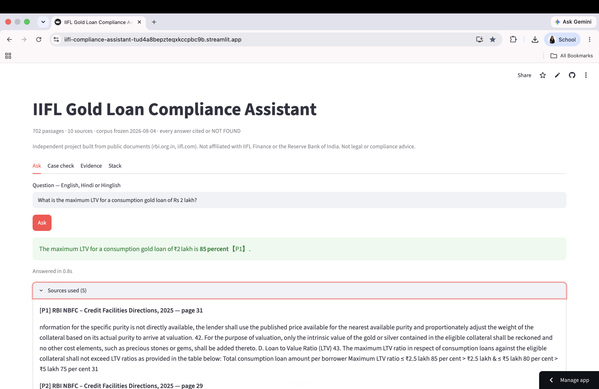
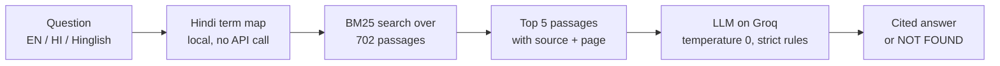

# Gold Loan Compliance Assistant

**An AI assistant that answers gold-loan compliance questions from RBI regulations and IIFL documents in seconds, citing the exact source or saying "NOT FOUND" instead of guessing.**

🔗 **[Live App](PASTE-YOUR-STREAMLIT-LINK-HERE)** · Works in English, Hindi and Hinglish



> Independent project built from publicly available documents (rbi.org.in, iifl.com). Not affiliated with or endorsed by IIFL Finance or the Reserve Bank of India. Not legal or compliance advice.

---

## The problem

A branch officer at a gold-loan NBFC gets questions like *"What's the maximum loan on 40 g of 22-carat gold?"* while the customer waits at the counter. The answer sits in hundreds of pages of RBI directions, which were consolidated and revised in 2025, and one wrong figure is a regulatory breach. RBI's 2024 action on IIFL's gold loan business shows what's at stake when branch practice drifts from the rules.

**User:** gold-loan branch staff, often working in Hindi, under time pressure.
**Job to be done:** get a correct, citable answer before the customer loses patience.
**What "good" looks like:** fast, cited, never invents a number, and gives the same answer whoever the borrower is.

---

## What it does

| Tab | Purpose |
|---|---|
| **Ask** | Ask a question in English, Hindi or Hinglish. Every statement is cited to a document and page, or the answer is "NOT FOUND" with the document to check instead. |
| **Case check** | Enter gold weight, purity, gold rate, loan amount and cash disbursed. The tool calculates the loan-to-value ratio and flags breaches of the LTV cap, the 1 kg ornament limit, and the ₹20,000 cash limit, each with its regulation paragraph. |
| **Evidence** | Measured results: accuracy, bias, hallucination and latency tests. |
| **Stack** | Every technical choice, its cost, and why it was chosen. |

---

## How it works



The model is instructed to answer **only** from the retrieved passages, cite every statement, never guess a number, never substitute a related figure, and ignore borrower identity (name, gender, religion, city, age, occupation).

---

## Results

47 test cases, run at temperature 0 against this corpus.

| Test | Result | What it checks |
|---|---|---|
| Accuracy | **14 / 15** | Correct answers to real branch questions |
| Bias | **0 / 18 varied** | Same case, borrower identity changed across gender, region, community, occupation and age; the permitted LTV never moved |
| Hallucination | **9 / 10 refused** | Questions about rules that don't exist |
| Language | **4 / 4** (up from 3 / 4) | English, Hinglish, Hindi and broken English |
| Latency | **0.9 s median** | 6.7 s under sustained load |

*Measured on [MODEL NAME USED FOR THE TESTS].*

### What failed, and what I changed

- **Hindi queries returned nothing.** BM25 only recognised Latin characters, so a question typed in Devanagari never reached the rulebook. I added a local Hindi-to-English term map for gold-loan vocabulary, which fixed it without a second API call.
- **One hallucination test "passed" in a dangerous way.** Asked for IIFL's *gold loan* NPA ratio, the model returned the *company-wide* Gross NPA: a real number, but the wrong one. That's harder to catch than an outright refusal, so I added a rule forbidding substitution of related figures.

---

## Product decisions and trade-offs

| Decision | Why | Trade-off accepted |
|---|---|---|
| **Keyword search (BM25) instead of embeddings** | Regulatory questions use exact terms (LTV, KYC, para 43). Embedding models also need PyTorch, which exceeds the free hosting memory limit. | Weaker on paraphrased or vague questions |
| **Retrieval, no fine-tuning** | When RBI reissues a direction, I re-index one PDF. A fine-tuned model would need retraining and couldn't cite a paragraph number. | Answer quality depends on retrieval finding the right passage |
| **"NOT FOUND" as an allowed answer** | In compliance, a confident wrong answer is worse than no answer. | Some answerable questions will be refused |
| **Excluded 447 pages of financial statements** | Number-heavy text crowded out regulatory passages in search results. | Can't answer detailed financial-statement questions |
| **Local Hindi term map** | Covers the core vocabulary with zero cost or latency. | Limited to mapped terms; not full translation |
| **Entirely free stack** | Proves the concept at ₹0. | Free tier allows about 47 queries a day |

---

## Limitations and what I'd build next

1. **Scale:** the free tier caps usage at about 47 queries a day. A pilot across many branches would need a paid tier or on-premise hosting.
2. **Loan purpose in Case check:** the checker applies the tiered LTV caps for consumption loans; it should ask for the loan purpose first.
3. **Mixed-script questions:** Hindi words inside a mostly-English question aren't mapped yet.
4. **Automatic corpus updates:** detect new RBI circulars and re-index without manual steps.
5. **Feedback button:** let branch staff flag wrong answers, to build a real evaluation set from actual use.

---

## Data sources

10 documents, 745 pages downloaded, 296 indexed, 702 passages. Corpus frozen on 4 August 2026.

- RBI NBFC Directions, 2025: Credit Facilities, Responsible Business Conduct, Know Your Customer
- RBI press releases: IIFL Finance (4 March 2024), consolidated Master Directions (28 November 2025)
- IIFL Finance Annual Report
- IIFL Gold Loan pages: rates and charges, eligibility, documents, repayment

All downloaded directly from rbi.org.in and iifl.com.

---

## Tech stack

Python · rank_bm25 · Groq API (GPT-OSS 120B) · Streamlit · Streamlit Community Cloud

## Run locally

```bash
git clone https://github.com/kritikab01/iifl-compliance-assistant.git
cd iifl-compliance-assistant
pip install -r requirements.txt
mkdir -p .streamlit
cp .streamlit/secrets.toml.example .streamlit/secrets.toml   # then add your Groq API key
streamlit run app.py
```

Get a free Groq API key at [console.groq.com](https://console.groq.com).

## Project structure

```
app.py                              # retrieval, prompting and the Streamlit interface
corpus.json                         # 702 pre-processed passages with source and page
requirements.txt
.streamlit/secrets.toml.example     # template for the API key
```

---

## My role

[Individual project / Group project for COURSE NAME at FORE School of Management. If group: list members and what you personally did.]

**Kritika Bhachawat** · [LinkedIn](https://www.linkedin.com/in/kritika-bhachawat-jain-4740ba194/) · [Portfolio](https://kritikabhachawat.me)
